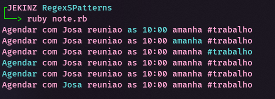

## Regex Reconhecedor em Lista de afazeres

### Sistema de gestão de listas

Este trabalho deve ser detectar padrões de texto em listas de afazeres. 

⇒ Reconhecer Horários: 
    
    10:30, 10 30, 10 horas, 1 hora, às 10

⇒ Reconhecer dias e datas

    28 de Fevereiro, 13 de agosto de 2021, 30/01, 20/04/2022, hoje, amanhã, depois de amanhã

⇒ Reconhecer tags #

    #casa, #trabalho, ...

⇒ Ações 

    agendar, marcar, ligar…

 

## Implementação

Implementamos as expressões separadamente, a depender da expressão, tratam-se erros. 

Considerando uma string alvo, aplicamos as expressões separadamente e guardamos os resultados (Matches) em uma lista.

Para melhor visibilidade, colorimos as strings com match.
